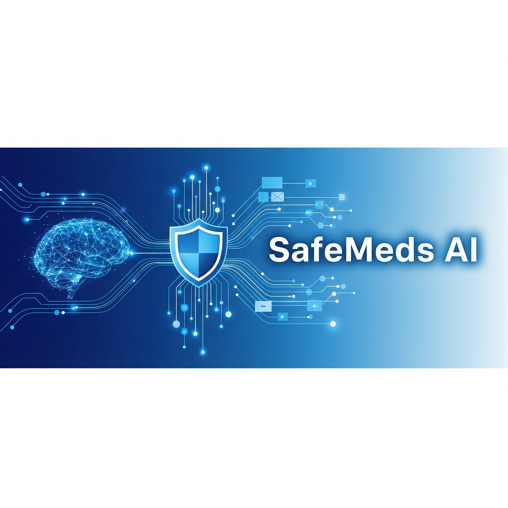
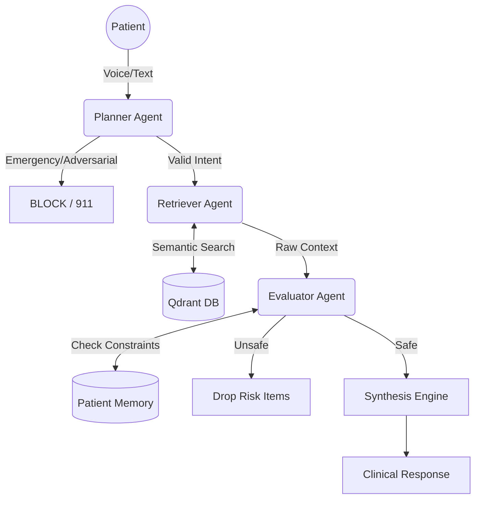

# 🛡️ SafeMeds AI: Deterministic Clinical Decision Support System
### Multi-Agent Orchestration • Qdrant Vector Search • Deterministic Safety



> **"A chatbot generates text. A medical system must generate SAFETY."**

SafeMeds AI is a **Clinical Decision Support System (CDSS)** that uses a **Hierarchical Multi-Agent Architecture** to prevent AI hallucinations in healthcare. Unlike standard RAG chatbots, SafeMeds enforces **deterministic safety constraints** (e.g., pregnancy contraindications) using a dedicated **Evaluator Agent** before the LLM ever generates a response.

---

## 🚀 Key Differentiators (Why This Matters)

| Feature | Standard RAG Chatbot | SafeMeds AI (Agentic) |
| :--- | :--- | :--- |
| **Architecture** | Linear (Input -> Retrieve -> Gen) | **Hierarchical State Machine** (Nurse -> Librarian -> Safety Officer) |
| **Safety** | Probabilistic (Prompt Engineering) | **Deterministic (Code-Based Veto Power)** |
| **Emergency** | Hallucinates advice for "Chest Pain" | **Planner Agent** triggers 911/Emergency Protocol |
| **Search** | Semantic Similarity Only | **Payload-Based Filtering** (FDA Categories in Qdrant) |
| **Input** | Text Only | **Multimodal Voice** (Whisper v3 via Groq) |

---

## 🏗️ System Architecture

Our system uses a **"Verify-Then-Generate"** pattern with three specialized agents:




## The Agent Roles

🧠 Planner Agent (The Triage Nurse):

Analyzes intent (Emergency vs. Information).

Capability: Instantly blocks "Drug Seeking" behavior or escalates "I can't breathe" to emergency services.

🔎 Retriever Agent (The Librarian):

Fetches data from Qdrant using hybrid search.

Capability: Pre-filters results based on user status (e.g., filter(rx_otc='OTC')).

🛡️ Evaluator Agent (The Safety Officer):

The Core Innovation: Applies deterministic rules against the retrieved data.

Example: If Patient.is_pregnant == True AND Drug.pregnancy_category == 'X', the drug is physically removed from the context window. The LLM never sees it.

---

## Tech Stack

Orchestration: Python (Streamlit)

Vector Database: Qdrant (Local Mode with Payload Filtering)

LLM Inference: Groq (Llama-3-8b-8192 for sub-50ms latency)

Voice ASR: OpenAI Whisper Large-v3 (via Groq)

Embeddings: all-MiniLM-L6-v2 (Sentence-Transformers)

---

## ⚙️ Setup Instructions

### 1. Install Dependencies

```bash
pip install -r requirements.txt
```

---

### 2. Configure Environment

Create a `.env` file in the root directory:

```bash
GROQ_API_KEY = "gsk_..."
```

---

### 3. Build the Knowledge Base

Ingest the medical dataset into Qdrant Local:

```bash
python indexer.py
```

Wait until you see:

```
SUCCESS: Knowledge Base built at 'qdrant_db'
```

---

### 4. Run the Agent System

```bash
streamlit run app.py
```

---

## 📸 Demo Scenarios (Testing the Safety)

### Scenario 1: The "Pregnancy" Safety Check

Context: User toggles "Patient is Pregnant" ON.

Query: "What can I take for acne?"

Result: The Evaluator Agent detects Accutane (Category X) in the search results and BLOCKS it. The system suggests safe alternatives or warns the user.

### Scenario 2: The "Emergency" Bypass

Query: "I can't breathe and my chest hurts."

Result: The Planner Agent detects an emergency intent. It bypasses the database entirely and displays a RED ALERT with emergency contact instructions.

### Scenario 3: Multilingual Voice (Health Equity)

Input: Voice recording in Hindi/Hinglish.

Result: Whisper v3 transcribes the audio, and the agents process the clinical query in English, returning a safe response.

---

## 📂 Repository Structure

```
SafeMeds-AI/
├── app.py             # Streamlit Orchestrator & UI
├── llm_engine.py      # Planner Logic & LLM Interface
├── indexer.py         # ETL Pipeline (CSV -> Qdrant)
├── drugs_dataset.csv  # Raw Medical Data
├── qdrant_db/         # Local Vector Store (GitIgnored)
├── assets/            # Images & Banners
├── requirements.txt   # Dependencies
└── README.md          # Documentation
```

---

## 👨‍💻 Author

Sumit AI Engineer | Safety-Critical Systems | RAG Architectures

---

**Disclaimer:** This project is a prototype for educational purposes. It is not a substitute for professional medical advice.

---
